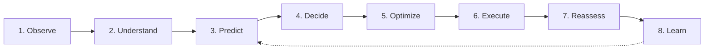

# Sisera Quantitative Trading Terminal: Complete User & Feature Guide

Welcome to the **Sisera** quantitative trading platform. Sisera is an institutional-grade, derivatives-native crypto algorithmic trading bot built specifically for **Bybit USDT Linear Perpetuals**.

---

## 1. Core Principles & Philosophy

1. **Derivatives-Native**: Incorporates native crypto derivatives mechanics: funding rate transfers, open interest dynamics, liquidation cascades, orderbook microstructures, and options implied volatility / skew.
2. **Free Tools & Low Overhead**: Relies exclusively on free public APIs (Bybit public REST/WS, CoinGecko, CoinPaprika, Deribit public indices) and zero-ops SQLite storage.
3. **EV & Risk-Gated**: Trading decisions are strictly gated by Expected Value (EV in R-units), profit factor, and risk metrics. Win rate is diagnostic only.
4. **Zero LLM in Critical Path**: Live scanning, scoring, risk calculation, and order execution operate deterministically with sub-second numerical execution.
5. **Shared Decision Provenance**: Every opportunity, approved trade, and rejected setup (`WAIT` / `NO_TRADE`) is immutably logged in a shared SQLite Decision Ledger with reason codes and plain-language rationales.

---

## 2. Intelligence Architecture (The 8-Stage Pipeline)



1. **Observe (Data Layer)**: Ingests Bybit perpetual orderbooks, trades, liquidations, multi-source market cap rankings, and options DVOL.
2. **Understand (Indicator & Regime Engine)**: Evaluates 20+ indicators across 5 orthogonal families and detects market regimes.
3. **Predict (Scoring & Calibration)**: Generates calibrated win probabilities via gradient boosted trees, isotonic regression, and conformal epistemic uncertainty intervals.
4. **Decide (Opportunity & Policy)**: Packages candidate trade theses and computes net Expected Utility ($U = EV - \text{drags}$).
5. **Optimize (Portfolio & Risk)**: Applies Kelly fractional sizing, isolated margin leverage ceilings, liquidation buffer stress tests, and beta caps.
6. **Execute (Execution Intelligence)**: Routes orders using dynamic alpha-decay post-only limits with orderbook depth slicing.
7. **Reassess (Position Intelligence)**: Re-evaluates active positions against non-price thesis invalidation criteria and trails stops.
8. **Learn (Backtest & Attribution)**: Replays history via Combinatorial Purged Cross-Validation (CPCV), calculates Deflated Sharpe Ratios, and decomposes realized P&L.

---

## 3. Multi-Family Indicator Engine

Indicators are partitioned into 5 independent families to prevent multi-collinearity and overfitting:

| Family | Key Indicators | Role & Signal Interpretation |
| :--- | :--- | :--- |
| **Technical** | `EMA Cross`, `RSI`, `MACD`, `ATR`, `Bollinger Width`, `OBV` | Trend direction, momentum acceleration, and price volatility. |
| **Derivatives** | `Funding Rate`, `Open Interest Trend`, `Long/Short Ratio`, `Order Book Imbalance`, `Basis`, `Liquidation Cascades` | Market positioning, leveraged crowd bias, and forced liquidation momentum. |
| **Options** | `Implied Volatility (IV)`, `DVOL Baseline`, `Put/Call Skew` | Forward volatility expectation and institutional tail-risk hedging. |
| **Fundamental** | `Market Cap Tier`, `MCap/Volume Ratio`, `Supply Dilution Risk`, `On-Chain Activity` | Liquidity tiering, floating supply overhang, and token economic health. |
| **Composite** | `Smart Money Divergence`, `Liquidity-Adjusted Momentum`, `Regime Detector` | Disentangles organic spot accumulation from crowded squeeze tops; scales momentum by depth. |

### Regime Detector & Stability Tagging
- **Regime Type**: Classifies into `TRENDING`, `MEAN_REVERTING`, or `CHOP` using ADX and a root-mean-square variance-of-differences Hurst Exponent ($H > 0.55$: trending, $H < 0.45$: mean-reverting).
- **Cascade Classifier**: Distinguishes `CAPITULATION` (reversal setups to fade) from `SQUEEZE` (trend acceleration to ride).
- **Stability State**: `STABLE` (clear regime), `TRANSITIONING` (regime shift underway — triggers leverage throttling), or `UNKNOWN`.

---

## 4. Scoring, Calibration & Uncertainty

### Timeframe Strategy Profiles
Each timeframe (`15m`, `1h`, `4h`, `1d`) operates with its own validated indicator composition, family weights, and independent gating floors:

- **15m Profile**: Short horizon dominated by fast derivatives microstructure, orderbook imbalance, and liquidation cascades.
- **1h Profile**: Balanced technical structure and funding/OI trends.
- **4h Profile**: Medium horizon aligned with the 8-hour funding cycle.
- **1d Profile**: Long holds incorporating options IV/skew and token fundamentals.

### Epistemic Uncertainty & Calibration
- **Isotonic Regression**: Applies the Pool-Adjacent-Violators (PAV) algorithm to map raw classifier scores to true empirical win probabilities $P(\text{win})$.
- **Conformal Prediction**: Quantifies epistemic uncertainty $\pm \sigma$ based on local feature space density and data freshness. High uncertainty directly discounts position size and penalizes expected utility.
- **Page-Hinkley Drift Detector**: Monitors prediction errors and flags regime shifts or feature degradation.

---

## 5. Opportunity Engine & Decision Policy

### Trade Thesis Structure
Every qualified candidate is packaged into an `Opportunity` object containing:
- **Direction**: `LONG` or `SHORT`.
- **Expected Value (EV)**: In R-units ($EV = P(\text{win}) \cdot b - (1 - P(\text{win})) \cdot 1$).
- **Holding Horizon**: Expected holding duration in bars (e.g. 12 bars on 1h = 12 hours).
- **Invalidation Conditions**: Structured non-price conditions that invalidate the trade thesis early:
  - `OI_COLLAPSE`: Open interest drops $> 8\%$ indicating capital exodus.
  - `FUNDING_FLIP`: Funding flips against position direction into overcrowded territory.
  - `REGIME_SHIFT`: Market regime stability drops below threshold.
  - `IMBALANCE_FLIP`: Orderbook bid/ask depth flips against trade direction.

### Expected Utility Formulation
The `DecisionPolicy` evaluates:
$$U = EV - \text{uncertainty\_drag} - \text{exec\_drag} - \text{crowding\_drag}$$

- **`TRADE`**: Clears utility threshold ($U \ge 0.04$) and EV floor $\rightarrow$ Sized and routed to execution.
- **`WAIT`**: Setup is viable but execution conditions (spread, top-5 depth) or timing are poor $\rightarrow$ Retained for re-evaluation.
- **`NO_TRADE`**: Sub-threshold utility, high risk, or thesis conflict $\rightarrow$ Logged with reason codes for "Why Not?" attribution.

---

## 6. Portfolio Risk Management & Sizing

### Sizing & Leverage
1. **Fractional Kelly Sizing**: Sizes positions proportional to calibrated edge $f^* = \frac{p \cdot b - (1-p)}{b} \times \text{Multiplier} \times (1 - \text{Uncertainty})$.
2. **Cluster Leverage Ceilings (Isolated Margin)**:
   - **Large Cap** (Top 20): Up to `5.0x` leverage.
   - **Mid Cap** (21-80): Up to `3.0x` leverage.
   - **Small Cap** (81+): Up to `2.0x` leverage.
   - *Regime Throttle*: Leverages are automatically scaled down by 30% during transitioning regimes.
3. **Liquidation Buffer Scenario Stress Check**:
   - Compares the distance to liquidation price against historical liquidation cascade wick distributions per cluster.
   - If a historical cascade wick could breach the liquidation price before the stop loss triggers, the order is rejected.

### Trailing Stops & DVOL Widening
- ATR trailing stops activate once price moves favorably by `1.0%`.
- **DVOL Forward Widening**: When Deribit DVOL index is elevated $> 15\%$ above baseline, trailing stops on BTC and ETH are automatically widened by `1.3x` to prevent premature shakeouts during volatility spikes.

### Portfolio Circuit Breakers
Trading is immediately paused if any breaker trips:
- **Max Portfolio Drawdown**: `15.0%` from peak equity.
- **Max Margin Utilization**: `70.0%` of total equity.
- **Max Daily Trades**: `20` trades/day.
- **Max Concurrent Positions**: `5` positions.

---

## 7. Execution Intelligence

- **Alpha-Decay Post-Only Limit Orders**: Places passive post-only limit orders at the best bid/ask to earn maker rebates (0.02%). If unfilled after dynamic alpha-decay horizon, cancels and falls back to an aggressive fill.
- **Order Slicing**: If order notional exceeds 15% of available top-5 orderbook depth, splits the order into multiple paced clips to minimize market impact.

---

## 8. Position Intelligence Engine

Open positions are continuously monitored in a fast sub-loop (every 60 seconds):
- **Stop Loss Breach**: Exits position immediately.
- **Thesis Invalidation**: If non-price invalidation triggers (e.g. OI collapse + funding flip), exits immediately *before* price hits the hard stop loss, conserving capital.
- **Regime Transitioning**: If regime stability degrades, tightens the trailing stop closer to current price to lock in accrued gains.
- **Partial De-risking**: Rebalances position notional when crowding levels spike.

---

## 9. Web Dashboard & REST/WebSocket API

### Starting the Web Dashboard
```bash
uv run sisera web --port 8000
```
Visit `http://localhost:8000` to open the interface.

### Dashboard Capabilities
- **Status & Regime Bar**: Live status indicator (● ONLINE / CIRCUIT BREAKER TRIPPED), current BTC regime state, and paper/live badge.
- **Portfolio KPI Metrics**: Total equity ($), cash balance, margin utilization gauge, peak drawdown vs breaker floor, active position counter, and daily trade counter.
- **Active Positions Panel**: Live table with direction badges (neon green LONG / crimson SHORT), size, entry price, liquidation buffer progress bar, active trailing stop levels, accrued funding, and a one-click **"Market Close"** button.
- **Multi-Timeframe Opportunity Screener**: Interactive candidate ranking table with filter tabs (`All`, `TRADE Only`, `WAIT / Monitor`, `Large Cap`), confidence meters, EV percentages, uncertainty intervals, and a **"Thesis"** button opening the trade thesis breakdown modal.
- **Immutable Decision Ledger**: Live feed of decisions with timestamp, symbol, timeframe, decision badge, reason code tags, and plain-language rationales.
- **Strategy Profile Gating**: Visual cards for 15m, 1h, 4h, 1d gating status.
- **Action Buttons**: **"Run Scan Cycle"** triggers an on-demand scan; **"Emergency Stop"** closes all open positions and halts trading.

### REST API Reference
- `GET /api/status` - System health, mode, universe size.
- `GET /api/portfolio` - Equity, margin ratio, drawdown, circuit breakers.
- `GET /api/positions` - Active positions with liquidation buffers.
- `GET /api/candidates` - Latest ranked candidates across timeframes.
- `GET /api/decisions?limit=50` - Decision ledger records.
- `GET /api/attribution` - Trade P&L decomposition & "Why Not?" stats.
- `GET /api/profiles` - Timeframe profile gating floors.
- `POST /api/scan` - Trigger full universe scan cycle.
- `POST /api/positions/{symbol}/close` - Market-close position.
- `POST /api/emergency_stop` - Emergency stop & position flush.
- `WebSocket /ws/live` - Live WebSocket streaming channel.

---

## 10. Interactive Telegram Bot

### Starting Telegram Polling
```bash
uv run sisera telegram
```
*(Ensure `SISERA_TELEGRAM_BOT_TOKEN` and `SISERA_TELEGRAM_CHAT_ID` are configured in `.env`)*

### Interactive Commands
| Command | Description |
| :--- | :--- |
| `/status` / `/portfolio` | Displays equity, cash balance, margin ratio, drawdown vs floor, open positions, daily trades, and circuit breaker status. |
| `/positions` | Shows all open positions with entry price, stop loss, liquidation price, and funding accrued. |
| `/scan` | Displays latest candidate opportunities and decision policy recommendations. |
| `/decisions [N]` | Returns the last $N$ entries from the immutable Decision Ledger. |
| `/circuit_breakers` | Details the 4 circuit breaker risk ceilings and their live trip statuses. |
| `/close <SYMBOL>` | Market-closes a specific open position (e.g. `/close BTCUSDT`). |
| `/emergency_stop` | Immediately flushes all open positions and halts trading. |
| `/help` | Lists available commands. |

### Real-Time Push Alerts
The bot automatically broadcasts formatted alerts:
- 🚀 **`TRADE_OPENED`**: Symbol, direction, leverage, notional size, entry price, stop loss, and EV.
- 🏁 **`TRADE_CLOSED`**: Symbol, realized P&L ($ and %), exit reason (stop loss, thesis invalidation, horizon).
- 🚨 **`CIRCUIT_BREAKER_TRIPPED`**: Reason, drawdown, margin ratio.
- ⚠️ **`INVALIDATION_TRIGGERED`**: Non-price thesis breakdown warning.
- 🔄 **`REGIME_SHIFT`**: Market regime transition alert.

---

## 11. Command-Line Interface (CLI)

Sisera provides a unified CLI entrypoint:

```bash
# Start Web Dashboard
uv run sisera web --host 0.0.0.0 --port 8000

# Start Telegram Bot Polling
uv run sisera telegram

# Run Full Trading Orchestrator with Web Dashboard and Telegram Alerts
uv run sisera run
```
